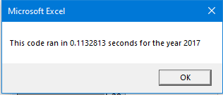
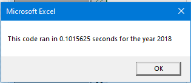

# VBA of Wallstreet

## Overview of Project
The purpose of this analysis is to automate the data analysis of stocks for Steve. Often used in the finance industry, VBA helps automate the analysis process instead of manually analyzing the stock data and using Excel formulas for calucations. The VBA process use code to automate tasks, crease chances of errors, and reduce the time to run analyses. In this project, refactored code is utilized to make the stock analysis quicker. When refactoring code, the code is more efficient, taking fewer steps, using less memory, or improving the logic of hte code to make it easier for future users to read. 

## Results

#2017 Stock Analysis

#2018 Stock Analysis

## Summary

